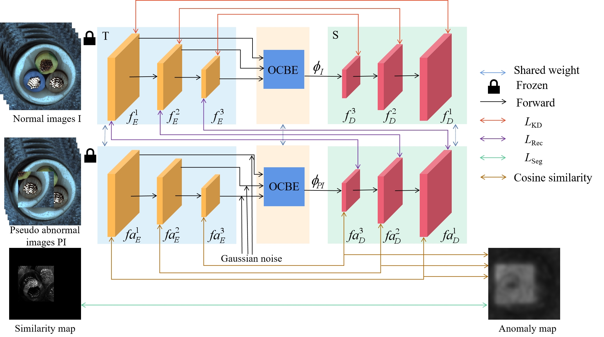
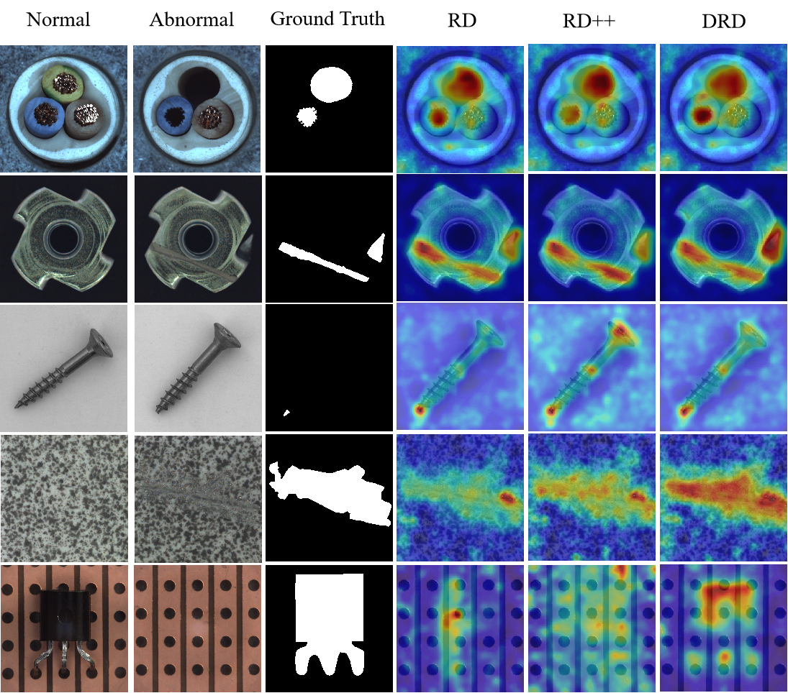

## A dual reverse distillation scheme for image anomaly detection

&nbsp;&nbsp;&nbsp;&nbsp;This paper proposes a Dual Reverse Distillation (DRD) scheme. DRD combines pseudo abnormal and normal images and restores their features with the reverse distillation method. It includes a novel Multi - Feature Cascade Fusion (MFCF) block, a combined knowledge distillation loss function, and a detection refinement method. The MFCF block improves feature integration across layers, and the loss function balances features from batch and individual images. The refinement method at the inference stage boosts detection accuracy. These strategies enhance the recovery of abnormal features and reduce over-generalization.
<br>&nbsp;&nbsp;&nbsp;&nbsp;Experiments on public datasets like MVTec, BTAD, and VisA verified DRD's effectiveness. For MVTec, it achieved 99.46% AUROC at the image level and 98.39% at the pixel level, outperforming RD. Ablation experiments also confirmed that DRD can effectively mitigate the over-generalization issue.
<br>
  
</div>
<br>
  
</div>

## Environment
matplotlib==3.7.5  <br>
numpy==1.20.3  <br>
opencv-python==4.5.1.48  <br>
pandas==1.5.3  <br>
scikit-image==0.19.3  <br>
scikit-learn==1.3.2  <br>
torch == 1.10.0+cu113  <br>
torchvision == 0.11.1+cu113  <br>
tqdm == 4.47.0  <br>
scipy==1.10.1  <br>
pillow ==7.2.0  <br>

## Train
Training on the all of dataset can be done directly
```bash
python train.py
```
If you want to train a separate category, replace the category you want to train with line 256 in train.py and run it.

## Evaluation
Select the category to be validated and the corresponding saved model parameters in line 159 of test.py, and run
```bash
python test.py
```

## Dataset
The dataset is from [MvTec](https://www.mvtec.com/company/research/datasets/mvtec-ad/)

## Citation
Please cite our paper if you find it's helpful in your work.

``` bibtex
@article{DBLP:journals/ijon/GeYZFCS25,
  author       = {Chenkun Ge and
                  Xiaojun Yu and
                  Hao Zheng and
                  Zeming Fan and
                  Jinna Chen and
                  Perry Ping Shum},
  title        = {A dual reverse distillation scheme for image anomaly detection},
  journal      = {Neurocomputing},
  volume       = {624},
  pages        = {129479},
  year         = {2025},
  url          = {https://doi.org/10.1016/j.neucom.2025.129479},
  doi          = {10.1016/J.NEUCOM.2025.129479},
  timestamp    = {Mon, 10 Feb 2025 22:47:33 +0100},
  biburl       = {https://dblp.org/rec/journals/ijon/GeYZFCS25.bib},
  bibsource    = {dblp computer science bibliography, https://dblp.org}
}
```

## Acknowledgement
We use [RD](https://github.com/hq-deng/RD4AD) and [RD++](https://github.com/tientrandinh/Revisiting-Reverse-Distillation) as the baseline. We are deeply grateful for their outstanding works.
